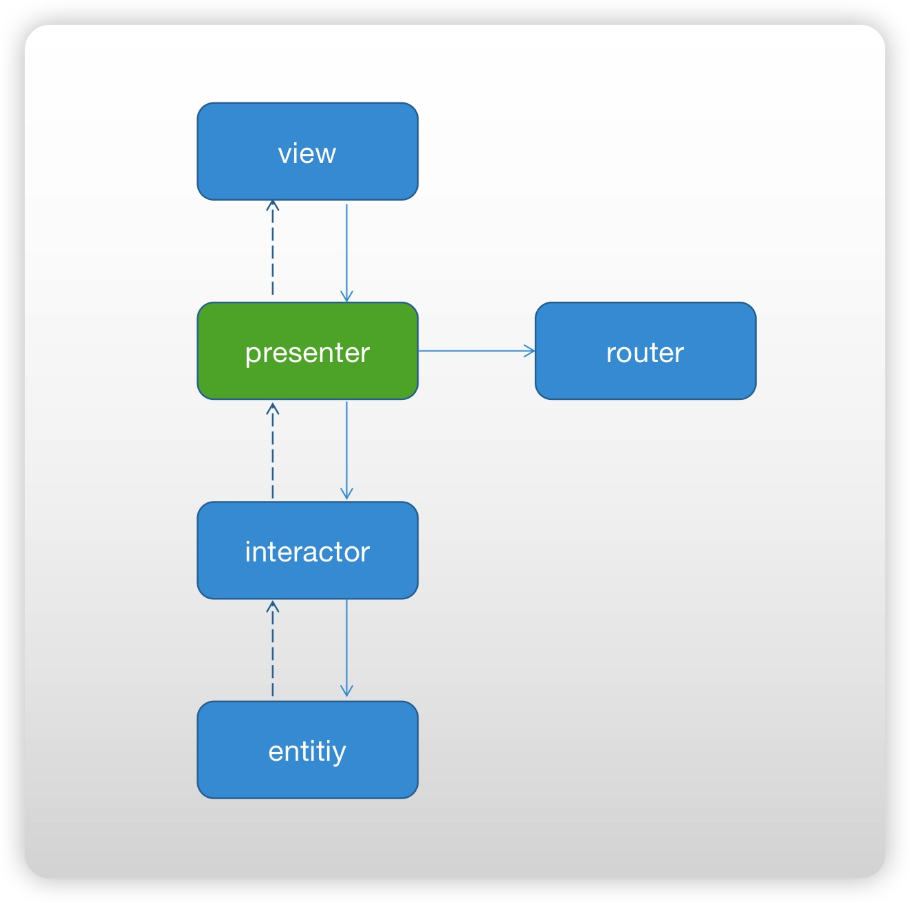
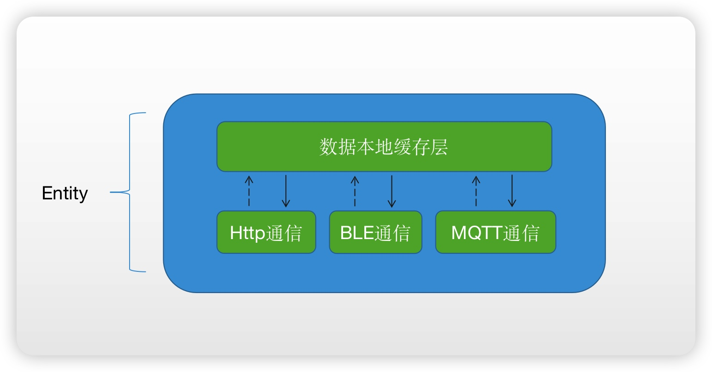
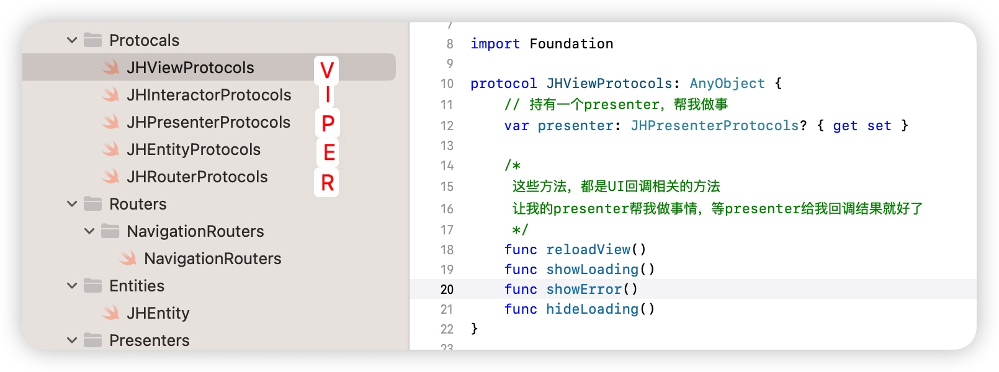
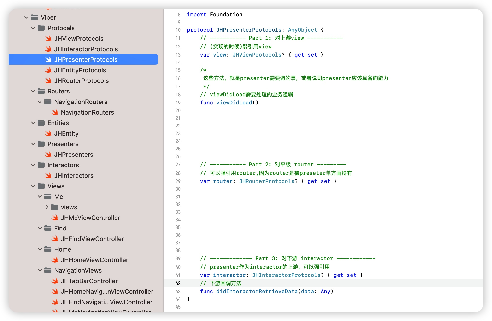
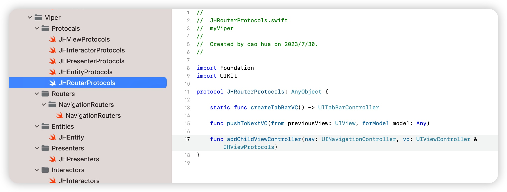
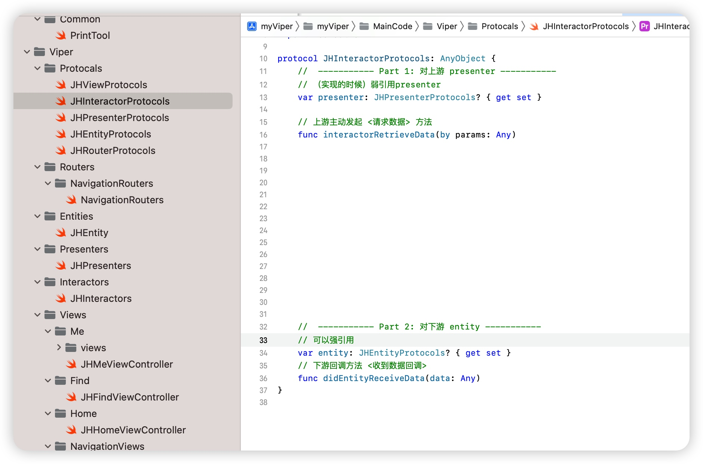
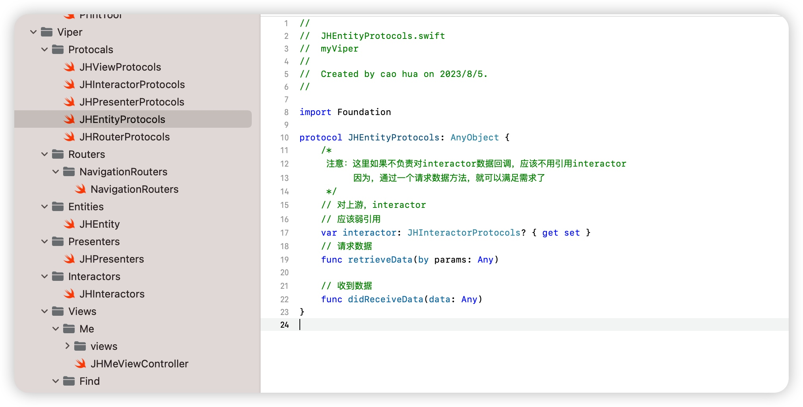

# 一、iOS_Viper
iOS的Viper架构，作为一个从业多年的iOS开发者，我个人认为应该要会一点viper

# 二、前言
1. viper的设计模式在iOS开发中不流行，甚至是Swift中，也没有用，我认为比较可惜。
2. 作为iOSer,当你掌握了viper，在设计模式上，你能超越90%的同行了。
3. viper理解起来需要一点时间成本，但是我希望你能静下心来，花一点时间理解它，在较大的时间项目中。
4. 使用它：
    1. 前期架构搭建耗时，相比mvc，mvvm, mvp等设计模式会增加约2天工作日左右。
    2. 但是后期随着业务的发展以及维护，会降低50%维护成本（长期看是节省时间，提升效率，减少加班）
# 三、架构图

## 3.1 分析架构图
1. 我们写代码中最怕的是什么？业务耦合度高！此架构最大的优势，就是帮助我们把业务解耦，同时带来最大的劣势就是使用成本高。因此需要根据项目来选择是否使用viper,而不是盲目推崇viper
2. 我们从上往下看，我们可以把view理解为一个组织中最高领导者。
3. view的功能，只处理UI相关的逻辑，例如刷新UI,添加弹窗，展示loading等。
    1. view是作为presenter的直接领导，所以view强引用presenter
    2. presenter给view汇报工作，需要谦卑一点（没见过给领导汇报工作还十分嚣张的吧），我们这里其实是为了防止循环引用
4. presenter作为这个组织架构中的中层管理者，是最累的角色（实际工作中，中层领导也是最累的）
    1. presenter对上级view需要汇报工作
    2. presenter对下级interactor需要指导工作
    3. presenter对助手router需要指导工作
5. router的角色，是辅助presenter做一些页面跳转的相关工作
6. interactor作为交互逻辑专职部门，主要工作是主导交互的数据处理，它的下级是entity
7. entity是底层干活的兄弟们（有没有被戳中?）
    1. interactor指导entity工作（强引用）
    2. entity给interactor汇报工作（弱引用）
    
## 3.2 延展分析
1. 对于entity，我们其实可以理解为数据处理层，在实际的较为复杂的业务场景中，可以参照如下模式，对entity进行进一步细分
 
# 四、代码解析
1. Swift提倡的是面向协议编程，我们把这5个模块都定义成协议
    
2. 对viewProtocols的分析
    
    1. 可以看到，viewProtocols是为view服务的，列举了4个常见的方法，刷新视图，展示loading，展示错误，隐藏loading
3. 对presenterProtocols的分析
    
    1. presenter 需要持有view，实现的时候要注意使用弱引用
    2. viewDidLoad方法，是在view需要主动调用的
    3. presenter 需要持有router，这里因为是单方面引用，所以需要用强引用
    4. presenter 需要持有interactor，因为是上级，所以强引用
    5. didInteractorRetrieveData方法，顾名思义，就是interactor给presenter的回调方法
4. 对routerProtocls
    
    1. createTabBarVC方法，就是一个静态方法，在appdelegate启动后，创建根视图所用的
    2. addChildViewController就是给UINavigationController提供一个初始化vc的方法，这里的vc，就是我们架构中的view层
    3. pushToNextVC方法不用过多解释了，就跳转带参数方法
5. 对interactorProtocols的分析
    
    1. interactor需要弱引用上级presenter
    2. 提供一个给presenter主动调用的方法，interactorRetrieveData
    3. interactor强持有下级entity
    4. didEntityReceiveData就是entity的数据回调方法
6. 对EntityProtocols的分析
    
     1. entity弱引用上级interactor
     2. retrieveData是给interactor主动调用的方法
     3. didReceiveData是回调方法